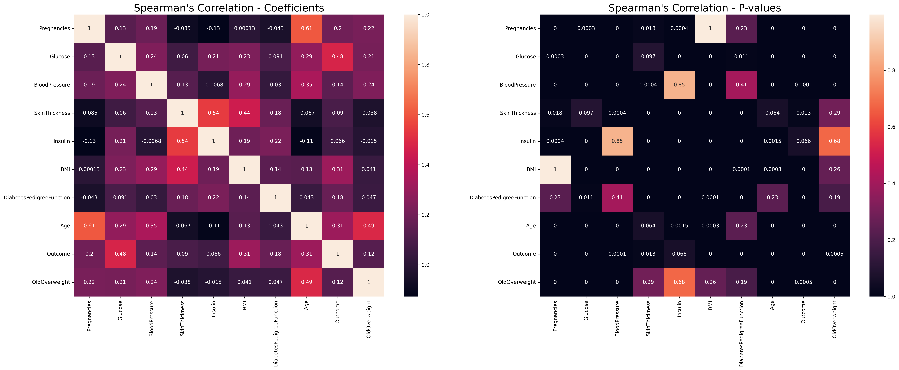

# Statistical Significance Testing: Explained With Examples In Python

Author: Casper Hansen

There is one essential question we are trying to answer with a statistical test: Are a set of values different from another set of values? In practice, it is used when you have one dataset that you can form hypotheses from, and you have another dataset that you can check your hypotheses against. However, a statistical significance test can only tell you *IF* and not *how* different the datasets are.

## Hypotheses & P-values

To formulate and test a hypothesis, we have to understand the goal we are trying to achieve when formulating one. The most common hypothesis is the null-hypothesis or $H_0$, which is a confusing name. In the null-hypothesis, we are trying to prove that a common fact is true by stating the opposite. In formal terms, we are trying to reject or nullify the null-hypothesis.

For example, you could imagine the datasets behind these hypotheses is from an exam where students are categorized into non-math, math, and math and programming students. Then you separate them into three different datasets to form the basis of your hypothesis testing:
- $H_0$ (Null-hypothesis): Math is not important to understand algorithms in data science.
- $H_1$ (Alternative hypothesis): A sufficient level of math is needed to understand algorithms in data science.

This is just two hypotheses, but do note that we can create a long series $H_0$ through $H_n$ to test for common facts. One might believe that you could have a $H_2$ that says:

- $H_2$: A sufficient level of math and programming skills are needed to understand algorithms in data science.

Once we get to a hypothesis that we cannot reject, we accept that hypothesis to be true and thus statistically significantly different. So, when we accept a hypothesis, it means that the dataset used is significantly different due to something else than chance.

Now, you might wonder, when do we reject or accept a hypothesis? We use a statistical test. There are [tens of different tests](https://docs.scipy.org/doc/scipy/reference/stats.html#statistical-tests) that are used for different purposes, but there is one universal component to all of the tests: they all generate a P-value. The significance level can be observed from the table below; if the P-value is greater than 0.05, then we usually reject a hypothesis, and we accept a hypothesis with a P-value below 0.05.

|Significance Level|Reject Hypothesis?|
|---|---|
|P-value > 0.05 (>5%)|Yes (Not significant)|
|P-value < 0.05 (<5%)|No (Significant)|
|P-value < 0.01 (<1%)|No (Very significant)|
|P-value < 0.001 (<0.1%)|No (Highly significant)|

**Note**: In practice with a limited amount of data, the significance level can sometimes be useful when set to below 0.1 (10%). This is however something that you should use carefully and only for practical purposes. For example, deciding a cutoff point in two lists of values.

## How To Test For Statistical Significance In Python

The sole purpose of showing how to do statistical significance testing in Python is to show you exactly how practical they can be. We will be looking at a [diabetes dataset from Kaggle](https://www.kaggle.com/uciml/pima-indians-diabetes-database) to run a series of statistical tests in Python. All the code can be found on my [GitHub page](https://github.com/casperbh96/Statistical_Significance_Testing) We start by loading the dataset and creating a new feature:

```python
df = pd.read_csv('data/diabetes.csv')
df["OldOverweight"] = df.apply(lambda x: True if x.Age >= 50 and x.BMI >= 25.0 else False, axis=1)
```

### Determining the distribution
Many statistical tests have a series of assumptions. One of the most common assumption is that the data being tested follow a Gaussian distribution (also known as a normal distribution or test for normality). Therefore, it would not make much sense to use those tests on the data that do not follow a Gaussian distribution - so, this is the first test.


A Gaussian distribution where $\mu$ is the mean and $\sigma$ is the standard deviation. In the Gaussian distribution, 68.26% of data falls within one standard deviation from the mean. [Image source](https://towardsdatascience.com/understanding-the-68-95-99-7-rule-for-a-normal-distribution-b7b7cbf760c2).

We will work with SciPy as the main package for the implementation of the statistical tests for normality. The API makes it simple and fast to perform these statistical tests. In the code snippet below, we make use of two different normality tests - Shapiro-Wilk and D'Agostino:

```python
def gaussian_test(col, values):
    stat1, p1 = stats.shapiro(values)
    stat2, p2 = stats.normaltest(values)

    print(f"Gaussian: {col}\n\t{p1:5f} (Shapiro-Wilk)\n\t{p2:5f} (D'Agostino's)")
```

You can run through every column and check the if the values fit into a Gaussian distribution. I found that all the p-values for the Shapiro-Wilk test were zero - suggesting that the every column is normally distributed. Applying the D'Agostino test, the result is largely the same except for a few columns that got close to the 0.001 significance level. This can be observed by the output of the function:

```
Gaussian: Glucose
        0.000000 (Shapiro-Wilk)
        0.002045 (D'Agostino's)
Gaussian: SkinThickness
        0.000000 (Shapiro-Wilk)
        0.000171 (D'Agostino's)
```

This means all the data pass the requirements of being normally distributed since no feature had a p-value above the significance level at 0.05. Furthermore, this means we can use *parametric tests* like T tests and Pearson's Correlation Coefficient. This does not mean we cannot use non-parametric tests - these tests are distribution-free. See [this page](https://www.ibm.com/docs/en/db2woc?topic=procedures-statistics-parametric-nonparametric) for more information about parametric and non-parametric tests.

### Checking for redundancy
The amount of correlation in your dataset can sometimes be hard to comprehend. You can check which features are redundant by applying correlation tests.

**Pearson's test**: We are testing whether two features have a linear relationship - meaning that if feature X increases or decreases by a value Z, then Y increases or decreases just as much as X. 

**Spearman's test**: We are testing whether two features have a monotonic relationship - meaning when feature X changes in a positive or negative direction, so does feature Y, but not necessarily by the same value. For example, if feature X is decreasing by -1.5 while feature Y is decreasing with -0.2.

When executing our script to check Pearson's Correlation Coefficient and Spearman's rank correlation coefficient, we apply the `stats.pearsonr` and `stats.spearmanr` methods from SciPy. We can execute both methods by the function below. In return, we get the P values values for the correlation test on every feature permutation - i.e. for all features, we run a correlation test versus the rest of the features:

```python
def correlation_test(df):
    pearson = df.corr(method=lambda x, y: stats.pearsonr(x, y)[1])
    spearman = df.corr(method=lambda x, y: stats.spearmanr(x, y)[1])

    pearson = pearson.round(4)
    spearman = spearman.round(4)

    return pearson, spearman
```

After we have calculated the correlations, we are left with a correlation map for each test. We use the Seaborn Python package to visualize them as a heatmap:

```python
def save_correlation_map(correlation_map, save_name, title):
    plt.figure(figsize=(12, 6))
    sns.heatmap(correlation_map, annot=True)
    plt.title(title, fontsize=20)
    plt.savefig(save_name, dpi=300, bbox_inches='tight')
```

As a result we get two heatmaps, one for Pearson's test and one for Spearman's test.

Inspecting the Pearson's correlation plot of p-values, we can quite clearly see tath BMI is correlating with Pregnanies and DiabetesPedigreeFunction. Basically, we are looking for anything above 0.05; any feature that has a p-value for correlation with another feature above 0.05 is found to be insignificantly different from the other feature.


Pearson's correlation coefficient on the diabetes dataset.

Inspecting Spearman's correlation, much of the same story is told, except for a few new features that are tremendously correlated with other features. Insulin and the constructed feature OldOverweight has an incredibly high p-value while the BMI and Pregnancies features increased to a p-value of 1. BloodPressure and Insulin also has a very large p-value.


Spearman's correlation coefficient on the diabetes dataset.

On a final note on correlation; making intuitive sense of a dataset is not always as easy as with our dataset for this article. We can quite clearly see that BMI and Pregnancies follow eachother linearly and monotonically - as expected. However, if you are working with sensor data where you cannot put your intuition on top quickly, then this becomes a tool to help you understand the sensor data faster.

### Finding a cutoff point
Perhaps this is what I have found most useful in my work. It is almost like a statistical way of finding outliers that does not require you to train a model. Using clustering algorithms can also help, but they add additional complexity which we do not need.

Levene's test vs ANOVA


```python
def bold_text():
    img1 = cv2.imread('data/logo.png')
    img2 = cv2.imread('data/heading.png')
    img3 = cv2.imread('data/body.png')

    bold1 = model.compute_thickness(img1)
    bold2 = model.compute_thickness(img2)
    bold3 = model.compute_thickness(img3)

    rng = np.random.RandomState(42)
    a_ton_of_text_boldness = rng.uniform(low=0.7, high=2.5, size=200)
    np.append(a_ton_of_text_boldness, [bold1, bold2])

    stat, p = levene(a_ton_of_text_boldness, [bold1, bold2], center='mean')
    print(bold1, bold2, bold3)
    print(f'{p:5f}')
```