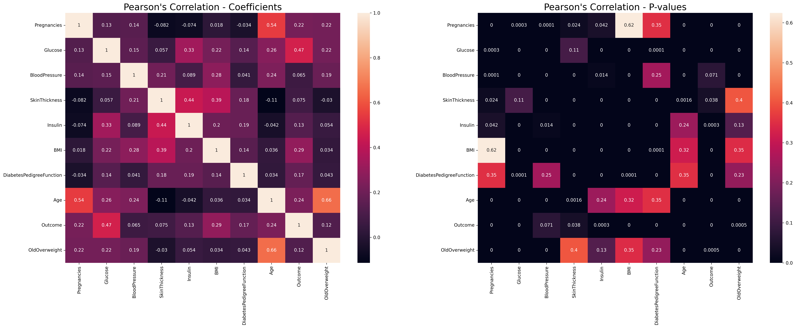

# Statistical Significance Testing: Explained With Examples In Python

Author: Casper Hansen

There is one essential question we are trying to answer with a statistical test: Are a set of values different from some assumption about these values? In practice, it is used when you have one dataset that you can form hypotheses from, and you have another dataset that you can check your hypotheses against. However, a statistical significance test can only tell you *IF* and not *how* different the datasets are.

## Hypotheses & P-values

To formulate and test a hypothesis, we have to understand the goal we are trying to achieve when formulating one. The most common hypothesis is the null-hypothesis or H<sub>0</sub>, which is a confusing name. In the null-hypothesis, we are trying to prove that a common fact is true by stating the opposite. In formal terms, we are trying to reject or nullify the null-hypothesis.

For example, you could imagine the datasets behind these hypotheses are from an exam where students are categorized into non-math, math, and math and programming students. Then you separate them into three different datasets to form the basis of your hypothesis testing:
- H<sub>0</sub> (Null-hypothesis): Math is not important to understand algorithms in data science.
- H<sub>1</sub> (Alternative hypothesis): A sufficient level of math is needed to understand algorithms in data science.

These are just two hypotheses, but do note that we can create a long series H<sub>0</sub> through H<sub>n</sub> to test for common facts. One might believe that you could have a H<sub>2</sub> that says:

- H<sub>2</sub>: A sufficient level of math and programming skills is needed to understand algorithms in data science.

Once we get to a hypothesis that we cannot reject, we accept that hypothesis to be true and thus some values in a dataset are proven to be statistically significantly different. So, when we accept a hypothesis, it means that the dataset used is significantly different due to something else than chance.

Now, you might wonder, when do we reject or accept a hypothesis? We use a statistical test. There are [tens of different tests](https://docs.scipy.org/doc/scipy/reference/stats.html#statistical-tests) that are used for different purposes, but there is one universal component to all of the tests: they all generate a P-value. The significance level can be observed from the table below; if the P-value is greater than 0.05, then we usually reject a hypothesis, and we accept a hypothesis with a P-value below 0.05.

|Significance Level|Reject Hypothesis?|
|---|---|
|P-value > 0.05 (>5%)|Yes (Not significant)|
|P-value < 0.05 (<5%)|No (Significant)|
|P-value < 0.01 (<1%)|No (Very significant)|
|P-value < 0.001 (<0.1%)|No (Highly significant)|

**Note**: In practice with a limited amount of data, the significance level can sometimes be useful when set to below 0.1 (10%). This is however something that you should use carefully and only for practical purposes. For example, deciding a cutoff point in two lists of values.

## How To Test For Statistical Significance In Python

The sole purpose of showing how to do statistical significance testing in Python is to show you exactly how practical they can be. We will be looking at a [diabetes dataset from Kaggle](https://www.kaggle.com/uciml/pima-indians-diabetes-database) to run a series of statistical tests in Python. All the code can be found on my [GitHub page](https://github.com/casperbh96/Statistical_Significance_Testing) We start by loading the dataset and creating a new feature:

```python
df = pd.read_csv('data/diabetes.csv')
df["OldOverweight"] = df.apply(lambda x: True if x.Age >= 50 and x.BMI >= 25.0 else False, axis=1)
```

### Determining the distribution
Many statistical tests have a series of assumptions. One of the most common assumptions is that the data being tested follow a Gaussian distribution (also known as a normal distribution or test for normality). Therefore, it would not make much sense to use those tests on the data that do not follow a Gaussian distribution - so, this is the first test.


A Gaussian distribution where μ is the mean and σ is the standard deviation. In the Gaussian distribution, 68.26% of data falls within one standard deviation from the mean. [Image source](https://towardsdatascience.com/understanding-the-68-95-99-7-rule-for-a-normal-distribution-b7b7cbf760c2).

The H<sub>0</sub> for the dataset is that all features are *not* normally distributed - and H<sub>1</sub> is the opposite. We will work with SciPy as the main package for the implementation of the statistical tests for normality. The API makes it simple and fast to perform these statistical tests. In the code snippet below, we make use of two different normality tests - Shapiro-Wilk and D'Agostino:

```python
def gaussian_test(col, values):
    stat1, p1 = stats.shapiro(values)
    stat2, p2 = stats.normaltest(values)

    print(f"Gaussian: {col}\n\t{p1:5f} (Shapiro-Wilk)\n\t{p2:5f} (D'Agostino's)")
```

You can run through every column and check if the values fit into a Gaussian distribution. I found that all the p-values for the Shapiro-Wilk test were zero - suggesting that every column is normally distributed. Applying the D'Agostino test, the result is largely the same except for a few columns that got close to the 0.001 significance level. This can be observed by the output of the function:

```
Gaussian: Glucose
        0.000000 (Shapiro-Wilk)
        0.002045 (D'Agostino's)
Gaussian: SkinThickness
        0.000000 (Shapiro-Wilk)
        0.000171 (D'Agostino's)
```

This means all the data pass the requirements of being normally distributed since no feature had a p-value above the significance level at 0.05. Furthermore, this means we can use *parametric tests* like T-tests and Pearson's Correlation Coefficient. This does not mean we cannot use non-parametric tests - these tests are distribution-free. See [this page](https://www.ibm.com/docs/en/db2woc?topic=procedures-statistics-parametric-nonparametric) for more information about parametric and non-parametric tests.

### Checking for redundancy
The amount of correlation in your dataset can sometimes be hard to comprehend. You can check which features are redundant by applying correlation tests.

**Pearson's test**: We are testing whether two features have a linear relationship - meaning that if feature X increases or decreases by a value Z, then Y increases or decreases just as much as X. 

**Spearman's test**: We are testing whether two features have a monotonic relationship - meaning when feature X changes in a positive or negative direction, so do feature Y, but not necessarily by the same value. For example, if feature X is decreasing by -1.5, feature Y could be decreasing by -0.2.

For this dataset, we can have an idea about the correlation, For example, the number of pregnancies is expected to be larger if you are 40 years old than if you are 18 years old. To this extent, we would make a qualified guess that H<sub>0</sub> states that no feature correlates with another feature - and H<sub>1</sub> says that there are features that indeed are correlated.

When executing our script to check Pearson's Correlation Coefficient and Spearman's rank correlation coefficient, we apply the `stats.pearsonr` and `stats.spearmanr` methods from SciPy. We can execute both methods by the function below. In return, we get the coefficients and P-values for the correlation test on every feature combination:

```python
def correlation_test(df):
    pearson_stat = df.corr(method=lambda x, y: stats.pearsonr(x, y)[0])
    pearson_p = df.corr(method=lambda x, y: stats.pearsonr(x, y)[1])
    spearman_stat = df.corr(method=lambda x, y: stats.spearmanr(x, y)[0])
    spearman_p = df.corr(method=lambda x, y: stats.spearmanr(x, y)[1])

    pearson_p = (pearson_p - np.eye(df.shape[1])).round(4)
    spearman_p = (spearman_p - np.eye(df.shape[1])).round(4)

    return pearson_stat, pearson_p, spearman_stat, spearman_p
```

After we have calculated the correlations and p-values, we are left with a correlation map for each test. We use the Seaborn Python package to visualize them as a heatmap:

```python
def save_correlation_map(stat, p_values, save_name, title):
    fig, axes = plt.subplots(nrows=1, ncols=2, figsize=(30, 10))
    sns.heatmap(stat, annot=True, ax=axes[0])
    sns.heatmap(p_values, annot=True, ax=axes[1])
    axes[0].set_title(title + ' - Coefficients', fontsize=20)
    axes[1].set_title(title + ' - P-values', fontsize=20)
    plt.savefig(save_name, dpi=300, bbox_inches='tight')
```

As a result we get two heatmaps for both the Pearson and Spearman test.

Inspecting the Pearson's correlation plot of p-values, we can quite clearly see that Age is correlating heavily with the number of Pregnancies, as would be expected. Any feature that has a p-value for another feature above 0.05 is deemed as uncorrelated with that feature - so, inspecting the feature correlation between OldOverweight and SkinThickness reveals a coefficient of -0.03 and a p-value of 0.4, meaning that they are statistically significant from each other.


This is Pearson's correlation test on the diabetes dataset. On the left hand, the coefficients are plotted to show the coefficient from -1 to 1, where 0 means no implied correlation. On the right hand, p-values for features *not* being correlated are plotted.

Inspecting Spearman's correlation, much of the same story is told. Insulin and the constructed feature OldOverweight have an incredibly high p-value while the BMI and Pregnancies features increased to a p-value of 1. BloodPressure and Insulin also have a very large p-value. This means these features are uncorrelated with each other.


This is Spearman's correlation test on the diabetes dataset. On the left hand, the coefficients are plotted to show the coefficient from -1 to 1, where 0 means no implied correlation. On the right hand, p-values for features *not* being correlated are plotted.

Using this information, we can construct models that perform better than if we use all available features. We know that Age, Outcome, and OldOverweight are greatly correlated with Pregnancies, so we can choose these features for a linear regression model. This is easily shown by our example below:

```python
def pregnancy_prediction(df):
    y_feature = 'Pregnancies'
    x_features = ['Age', 'Outcome', 'OldOverweight']
    model.linear_regression_model(df, x_features, y_feature)

    x_features = ['Glucose', 'BloodPressure', 'SkinThickness', 'Insulin',
       'BMI', 'DiabetesPedigreeFunction', 'Age', 'Outcome', 'OldOverweight']
    model.linear_regression_model(df, x_features, y_feature)
```

We train linear regression models using these features and calculate the R-squared metric on the test set.

```python
def data_split(df, x_features, y_feature):
    X_train = df.loc[:, x_features]
    y_train = df.loc[:, y_feature]

    return train_test_split(X_train, y_train, test_size=0.2, random_state=42)


def linear_regression_model(df, x_features, y_feature):
    X_train, X_test, y_train, y_test = data_split(df, x_features, y_feature)

    model = LinearRegression()
    model.fit(X_train, y_train)
    pred = model.predict(X_test)
    r2 = r2_score(y_test, pred)

    print(f'Linear Regression R^2: {r2}')
```

The outcome for our program is an R-squared of 0.3397 when only using Age, Outcome, and OldOverweight, and there is a very slight increase in the R-squared value to 0.3468 when using all the available features. This goes to show that we can make our models incredibly simple while keeping the best possible R-squared score.

### Finding a cutoff point
Perhaps this is what I have found most useful in my work. It is almost like a statistical way of finding outliers that do not require you to train a model. Using clustering algorithms can also help, but they add additional complexity which we do not need.

#### Setting up the example

This will be the most complicated real-life example for this article. We will use a new dataset that I created using Paint with some company name or logo, a section heading, and a body of text. The idea is that they all have similar features, but we want to be able to tell which is a section heading using computer vision methods and a statistical test to help identify the outlier.


The example text created for calculating boldness on every line.

Now, let's say we open the images individually using OpenCV and then call a compute thickness function to get a value for the boldness of the text. We then print the values and inspect them.

```python
def bold_text():
    img1 = cv2.imread('data/logo.png')
    img2 = cv2.imread('data/heading.png')
    img3 = cv2.imread('data/body.png')

    bold1 = model.compute_thickness(img1)
    bold2 = model.compute_thickness(img2)
    bold3 = model.compute_thickness(img3)

    print(bold1, bold2, bold3)

    significance.boldness_test(bold1, bold2, bold3)
```

For the logo, we get a boldness value of 13.21, while the section heading gets 4.47, and the body of text gets 2.28. This means we have detected that the boldness of the logo is much larger than just the section heading. 

```python
def compute_thickness(img):
    # White to black pixels and black to white pixels
    img = cv2.cvtColor(img, cv2.COLOR_BGR2GRAY)
    inverted = cv2.bitwise_not(img)

    # select from text start x,y to text end x,y
    white_pt_coords=np.argwhere(inverted)
    min_y = min(white_pt_coords[:,0])
    min_x = min(white_pt_coords[:,1])
    max_y = max(white_pt_coords[:,0])
    max_x = max(white_pt_coords[:,1])
    inverted = inverted[min_y:max_y,min_x:max_x]

    # thin image and calculate difference from the inverted image
    thinned = cv2.ximgproc.thinning(inverted)
    return (np.sum(inverted == 255) - np.sum(thinned == 255)) / np.sum(thinned == 255)
```

Visually, the following is what happens to an image. We can see that the background becomes black and the text becomes white when inverted. The reason for this process is to count the number of white pixels before and after thinning the text. Then we can measure the difference in white pixels between the inverted and thinned image, and therefore calculate a boldness value.


Upper: The normal image. Middle: The inverted image. Lower: The thinned image.

You might not think this is a problem (at first), but we need to decide a common threshold value level to decide when we have identified a section or body text. This is useful for segmenting and analyzing papers by identifying every section and looking into the body and analyzing that specific part after applying OCR.

To decide on a threshold, we should normalize our boldness values, so that they are between 0 and 1. This is quite trivial, but if we had multiple section headings in a paper, the boldness value would differ slightly from article to article. Therefore, we need to filter out the values that have too large of a variance from a series of boldness values. 

#### Applying the tests

The most well-known is the analysis of variance (ANOVA) test, and a less well-known test is Levene's test. To construct an example, we use the boldness of the section to generate 200 random values from 0.7 to the boldness value + another 0.5 to account for other section headings that could have larger boldness values. The assumption is that some of the text will have small boldness values, therefore we use a small value to set the lowest number for the generation of the distribution.

We have a hunch about the fact that the logo, title, or company are bolder than a section heading, so for our dataset, the H<sub>0</sub> is that the company name is just as bold as the section headings - while, of course, the opposite is true for H<sub>1</hub>.

We want to cross-check whether the distribution we created, which supposedly contains boldness values from a random body of text and multiple headings. For Levene's test, this means we pair boldness values with each other with the assumption that they fit into the distribution. If we introduce too large of a boldness value, then we can use these tests to exclude that value.

```python
def boldness_test(bold1, bold2, bold3):
    rng = np.random.RandomState(42)
    a_ton_of_text_boldness = rng.uniform(low=0.7, high=bold2 + 0.5, size=200)

    variance_check = [[bold1, bold2], [bold2, bold3]]

    for check in variance_check:
        stat1, p1 = levene(a_ton_of_text_boldness, check, center='mean')
        stat2, p2 = f_oneway(a_ton_of_text_boldness, check)

        print(f'{p1:5f}')
        print(f'{p2:5f}')
```

In our example, the first array containing bold1 and bold2 gets a p-value of 0 for both tests - which is to be expected, because they both fall into the distribution. However, the case is different when we pair bold2 and bold3. We get the p-values 0.98 for Levene's test and 0.50 for the ANOVA test.

The interpretation is that we first checked the bold1 and bold2 pair, which ran into no issues of being statistically significant from the distribution. In a sense, this means that both these values are "cleared". But when we introduce bold3 into a pair with bold2, we observe that the boldness value array is statistically significant from the distribution. Since we introduced bold3, it means that this value is the odd one out - the one to remove from our dataset.

After removing bold3 from our dataset, we go and standardize the values and can apply a threshold value. For example, one could apply a threshold value at 0.65 and a rule saying: *anything above the threshold is a section heading*. 

## Conclusion

These statistical tests are important to have in your toolbox so that you can analyze data and solve real-world problems. We have now seen how multiple statistical tests can be of use in practical scenarios. You have gotten an introduction on p-values, hypotheses, and subsequently now seen them applied to datasets. In the future, you should be able to do the visualizations and implement a statistical test on your exact dataset.